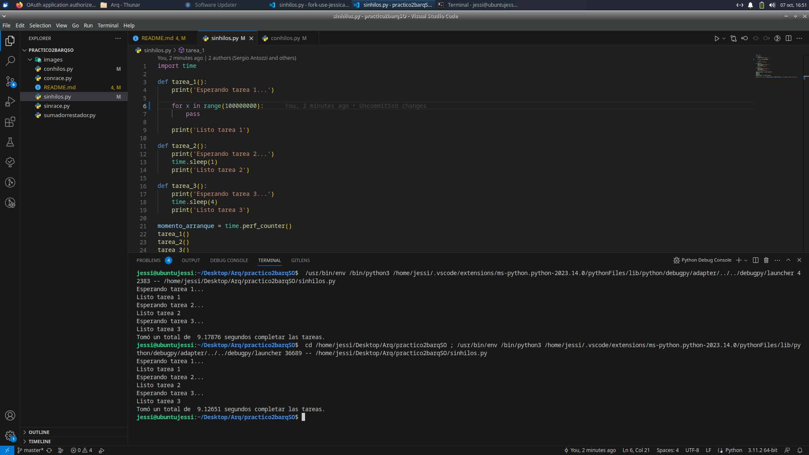
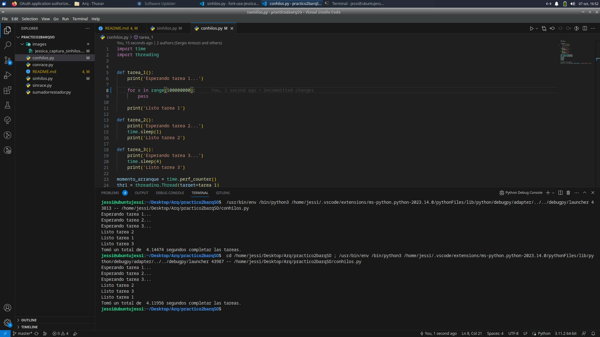

# Práctico 2b para Arquitectura y Sistemas Operativos UTN

* 1. Capturas

procesador intel core i5 10°generación

 
procesador intel core i7 11° generación

 
procesador

 

* 1a) El tiempo de ejecución en la tarea 1 depende del procesador de la máquina donde se ejecute. Sin embargo, la tarea 2 y 3 tienen una demora fija indistintamente de la máquina donde se ejecute. Las tareas son secuenciales ya que trabajan con un solo hilo. En conclusión, al no saber el tiempo exacto que se demora la primer tarea no podemos saber cual va a ser el tiempo resultante. No obstante si volvemos a ejecutarlo podríamos decir que el tiempo es predecible ya que va a arrojar un resultado igual o muy parecido al anterior.

* 1b) La velocidad de compresión y descompresión está directamente relacionada con la
capacidad de procesamiento de la máquina. Cuanto más rápida sea la máquina, más rápido
se completará el proceso. En este caso, la velocidad de la máquina es un factor crítico y
determina la velocidad máxima posible de compresión y descompresión.

* 1c) Cuando se descargan archivos desde internet, la velocidad de descarga puede variar
dependiendo de varios factores, como la velocidad de la conexión a internet, la congestión de
la red o la capacidad del servidor desde el cual se está descargando el archivo. Esto significa
que el tiempo que lleva completar la descarga puede ser impredecible y no necesariamente
depende de la velocidad de procesamiento de la computadora.

* 2. Capturas

procesador intel core i5 10°generación

 
procesador intel core i7 11° generación

 
procesador

 

* 2a) Al ejecutarse los procesos en paralelo el tiempo de ejecución va a ser similar al proceso que tarde más. El tiempo de respuesta con respecto al mismo programa sin hilos mejoró.
* 2b) Las funciones no completan su ejecución en el orden establecido
* 2c)

* 3 Capturas

procesador intel core i5 10°generación

 
procesador intel core i7 11° generación

 
procesador

 

* 3.a)

* 4 Capturas

procesador intel core i5 10°generación

 
procesador intel core i7 11° generación

 
procesador

 

* 4.a)

* 4.b)

* 4.c)

* 4.d)